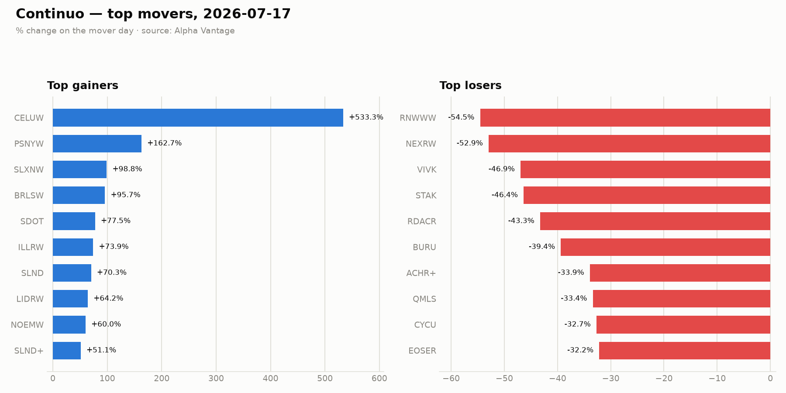

# Continuo

Will today's top mover keep moving tomorrow? Continuo is a backend-first ML pipeline that ingests the daily stock-market "top movers," stores them in Postgres, and (later) engineers features, trains a next-day continuation classifier, and serves predictions over a REST API. It's a portfolio project focused on engineering discipline — pipeline shape, IaC, CI/CD, honest backtesting — not a trading bot.

See [CONTINUO.md](CONTINUO.md) for the full plan and task breakdown.

## Pipeline so far (Days 1–3, all local)

```
Alpha Vantage TOP_GAINERS_LOSERS
  → fetch_movers.py → data/raw/movers_<date>.json  (raw archive)
                    → Postgres top_movers            (idempotent upsert)
  → plot_movers.py → reports/movers_<date>.png       (chart)
  ↳ run_daily.sh via cron (01:30 daily, after US close)
```

## Quickstart

```bash
python -m venv .venv && source .venv/bin/activate
pip install -r requirements.txt
cp .env.example .env          # paste your Alpha Vantage key into .env
docker compose up -d          # local Postgres on host port 5433
python fetch_movers.py        # save raw JSON + upsert into top_movers
python plot_movers.py         # render reports/movers_<date>.png
```

Free Alpha Vantage key: <https://www.alphavantage.co/support/#api-key>

## Daily automation

`run_daily.sh` brings up Postgres, ingests, and redraws the chart; it's idempotent
(re-running for the same trading day updates rows in place). A cron entry runs it
at 01:30 Asia/Dubai — just after the US market close:

```
30 1 * * * /path/to/continuo/run_daily.sh # continuo-daily-ingest
```

## AWS deployment (Days 4–7)

The ingestion runs on AWS as a scheduled container Lambda. Terraform ([infra/](infra/))
provisions ECR, an S3 raw archive, RDS Postgres (`db.t4g.micro`), a least-privilege
Lambda role, the ingestion Lambda (from the container image), and an EventBridge rule
(21:30 UTC Mon–Fri, after the US close).

```bash
aws sso login                                   # authenticate first
cd infra
cp terraform.tfvars.example terraform.tfvars    # fill in db_password + alpha_vantage_api_key
./deploy.sh                                      # create ECR → build+push image → apply stack

# manually invoke the ingestion Lambda (writes a row to RDS + JSON to S3):
aws lambda invoke --function-name "$(terraform output -raw lambda_function_name)" /dev/stdout
```

`deploy.sh` resolves the image chicken-and-egg (Lambda needs an image that exists
first) by creating the ECR repo, pushing `linux/amd64`, then applying the rest.

## Model & backtest (Week 2)

Feature engineering + a next-day continuation classifier live in [ml/](ml/):

```bash
export DATABASE_URL=postgresql://…            # point at RDS (or local)
python ml/backfill_ohlcv.py   # yfinance daily bars -> ohlcv table (cache, idempotent)
python ml/build_features.py   # v1 features + next-day label -> features table
python ml/train.py            # baseline + walk-forward + models/xgb_v{n}.json (+ metrics.json)
python ml/backtest.py         # walk-forward OOS metrics only
```

**v1 features** (all known at the mover-day close — no lookahead): gap %, mover-day % change,
relative volume (vs 20-day avg), 5-day prior trend, day of week, gainer/loser.
**Label:** next-day close > mover-day close (close-vs-close).

**Honest result** (12 trading days, 250 labelled movers so far):

| Evaluation | AUC | Accuracy | Precision | Recall |
|---|---|---|---|---|
| 70/30 time holdout | 0.66 | 0.66 | 0.50 | 0.44 |
| **Walk-forward OOS** (8 folds) | **0.59** | 0.58 | 0.53 | 0.31 |

The walk-forward number is the one to trust, and it's **barely above a coin flip (0.5)** — as
the project anticipated. With only 12 days accumulated this isn't yet statistically meaningful;
the value here is a correct, no-lookahead harness that will produce a real verdict as the daily
EventBridge ingestion grows the dataset. Time order is respected everywhere — no k-fold shuffling.

## Known limitations

- **Public RDS.** To avoid a NAT gateway (~$32/mo), the non-VPC Lambda reaches RDS
  over its public endpoint; the security group defaults to open on 5432 and the
  master password is the real control. Tighten `db_ingress_cidr` for interactive use.
- **Secrets in Lambda env.** `DATABASE_URL` (with password) and the API key live in
  the Lambda environment / Terraform state, not Secrets Manager — a cost/complexity
  tradeoff for a portfolio project.
- Costs money while up: RDS `db.t4g.micro` is ~free-tier-eligible (<12mo accounts),
  otherwise ~$12–15/mo. `terraform destroy` tears it all down.
- **Tiny dataset.** Movers only accumulate one trading day at a time (the API has no
  history), so the model is near-chance and metrics aren't yet significant — by design.
- OHLCV comes from **yfinance** (bulk, free) rather than Alpha Vantage, whose free tier
  (25 req/day) can't backfill 300+ tickers. Warrant/unit symbols Yahoo lacks are dropped.

## Sample output



## Data model

`top_movers` — one row per ticker per trading day (`UNIQUE (ticker, date)`), storing
direction (gainer/loser), % change, price, and volume. Schema in [db/schema.sql](db/schema.sql).
